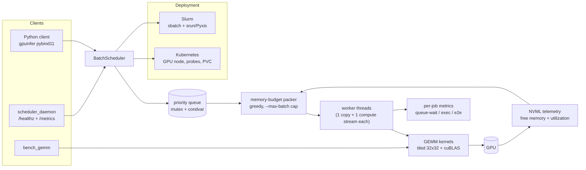

# gpu-batch-inference-scheduler

A GPU batch-inference scheduler in C++17/CUDA. Clients submit small GEMM
"inference jobs" (a `C[b] = A[b] * B[b]` batched matrix multiply is the
stand-in for a model layer); the scheduler holds them in a thread-safe
priority queue, packs the largest set that fits the live GPU memory budget
(free NVML memory minus a safety margin), and executes the packed batches on
dedicated CUDA streams with H2D transfers overlapped with compute via pinned
host memory. Every job's queue-wait, execution, and end-to-end latency is
recorded, and the whole thing ships as a native binary, a Docker image, a
Kubernetes workload, or a Slurm job — with a pybind11 module (`gpuinfer`) for
Python callers. Custom tiled and cuBLAS batched-GEMM kernels, an NVML
telemetry loop, a Prometheus `/metrics` endpoint, and an identical benchmark
workload runnable three ways round out the story.



## Results

> [!NOTE]
> No CUDA GPU was available in the environment where this repository was
> finalized, so the tables below are **pending a GPU run** and intentionally
> contain no invented numbers. Run the commands under each table on a CUDA
> host and replace the placeholders.

### GEMM benchmark (batch 8, float32, 10 iters)

Generate with two runs of the C++ harness (each row already includes the CPU
baseline and speedup):

```sh
./build/bench_gemm --m 1024 --n 1024 --k 1024 --batch 8 --iters 10 --impl tiled
./build/bench_gemm --m 1024 --n 1024 --k 1024 --batch 8 --iters 10 --impl cublas
```

`python python/benchmark.py` additionally verifies GPU vs NumPy within
`rtol=1e-3` and writes `results/benchmark.csv` + `results/speedup.png`.

| Shape (B x M x N x K) | CPU ms (NumPy) | tiled kernel ms | cuBLAS ms | Speedup vs CPU (tiled / cuBLAS) |
|---|---|---|---|---|
| 2 x 256 x 256 x 256 | — | — | — | — / — |
| 4 x 512 x 512 x 512 | — | — | — | — / — |
| 8 x 1024 x 1024 x 1024 | — | — | — | — / — |
| 1 x 2048 x 2048 x 2048 | — | — | — | — / — |


### Scheduler (1000 synthetic jobs, arrival rate 20 jobs/s, 2 workers)

Generate with `./build/scheduler_daemon --jobs 1000 --arrival-rate 20`
(summary printed on shutdown; per-job rows in `scheduler_metrics.csv`).

| Metric | Value |
|---|---|
| Throughput | — jobs/s |
| p50 / p95 / p99 e2e latency | — / — / — ms |
| Mean GPU utilization (NVML) | — % |
| GPU memory-budget compliance (OOMs) | 0 OOM across 1000 jobs (pending GPU confirmation) |

### Profiling breakdown (nsys)

From `docs/PROFILING.md`, generated by `scripts/profile.sh`:

| Category | Time (ms) | % of wall time |
|---|---|---|
| GPU kernels | — | — |
| Memcpy HtoD | — | — |
| Memcpy DtoH | — | — |
| Other (CPU / gaps) | — | — |
| **Total** | — | 100.0 |

## Quickstart

```sh
# Local build + benchmark (needs CUDA toolkit, CMake >= 3.22)
cmake -B build
cmake --build build -j
./build/bench_gemm --m 1024 --n 1024 --k 1024 --batch 8 --iters 10 --impl cublas

# Python bindings
pip install -e .
python -c "import numpy as np, gpuinfer; a=np.random.rand(4,512,512).astype('float32'); b=np.random.rand(4,512,512).astype('float32'); print(gpuinfer.batched_gemm(a,b).shape)"

# Docker (needs nvidia-container-toolkit)
docker build -t gpuinfer/scheduler:latest -f deploy/Dockerfile .
docker run --rm --gpus all -p 8080:8080 gpuinfer/scheduler:latest
docker run --rm --gpus all --entrypoint bench_gemm \
  gpuinfer/scheduler:latest --m 1024 --n 1024 --k 1024 --batch 8 --iters 10 --impl cublas

# Kubernetes (needs the NVIDIA device plugin; see deploy/k8s/README.md)
kubectl create -f https://raw.githubusercontent.com/NVIDIA/k8s-device-plugin/v0.15.0/deployments/static/nvidia-device-plugin.yml
kubectl apply -k deploy/k8s

# Slurm (container via Pyxis/enroot, else bare binary)
sbatch deploy/slurm/submit.sbatch
bash deploy/slurm/sweep.sh   # job array over a shape sweep, collated CSV
```

The daemon serves `GET /healthz` and Prometheus-format `GET /metrics` on
`:8080`; `--jobs 0` runs until SIGINT, `--force-cpu` runs without a GPU.

## Testing

```sh
ctest --test-dir build --output-on-failure   # GoogleTest suite
PYTHONPATH=build pytest python/ -q            # pytest suite
PYTHONPATH=build pytest python/ -q -k "not gpu"   # CPU-only subset
```

Current counts (GPU-less environment): **8 GoogleTest cases** (1 GPU-only
skip) and **13 pytest tests** (5 GPU-only skips). GPU-dependent tests skip
cleanly when `cudaGetDeviceCount()` returns 0. CI
(`.github/workflows/ci.yml`) runs the build, `clang-format --dry-run
--Werror`, clang-tidy, the CPU-only test subsets, and lint for the deploy
manifests; `pre-commit` hooks cover clang-format, black, and ruff.

## Limitations + Future Work

- **Single GPU, single node**: the scheduler budgets against one device.
  Multi-GPU needs an NCCL-aware sharding/placement layer (device-affinity
  per job, cross-GPU reduction for split layers) — `cudaMemcpyPeer`-based
  or NCCL collectives as the next transport abstraction.
- **GEMM stand-in only**: the workload is batched float32 GEMM. Real
  inference would add a TensorRT engine path (serialized engines per model,
  persistent inference execution contexts) and cuDNN convolution ops,
  plugged in behind the same `InferenceJob` interface.
- **No MIG partitioning**: the safety margin is a single scalar; MIG
  instances would need per-instance budget discovery via NVML device
  enumeration.
- **Static safety margin**: 256 MiB headroom by default; future work is a
  feedback controller that adjusts the margin from allocation-failure
  history (exponential backoff on OOM).
- **Fairness**: greedy packing favors small jobs; large jobs can starve
  under sustained small-job arrival. A waiting-time-priority bump is the
  planned fix.

## Documentation

- `docs/DESIGN.md` — packing algorithm + complexity, stream-overlap model,
  safety-margin choice, thread-safety argument
- `docs/PROFILING.md` — profiling workflow and bottleneck analysis
- `deploy/README.md` — the identical-workload-three-ways walkthrough
- `deploy/k8s/README.md` — device plugin install and local testing
